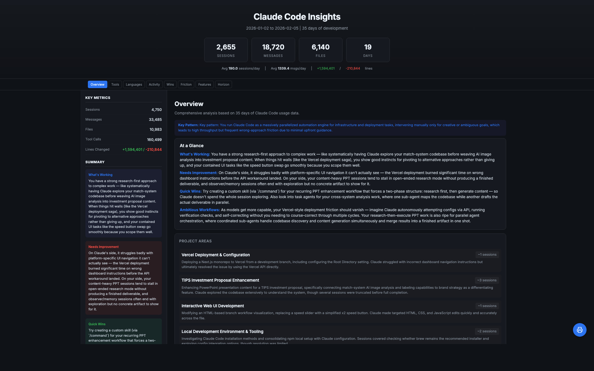

# insights-ui

> Transform Claude Code Insights into a dark-mode interactive dashboard + MP4 video

[한국어](README-ko.md)

## Dashboard



## Video


## Features

- Dark-mode interactive dashboard with animations, counters, and tooltips
- Bilingual support (English / Korean with full content translation)
- MP4 video generation with particle effects and dynamic animations (Remotion)
- Scroll spy navigation, collapsible sections, sortable charts
- Print-friendly layout

## Installation

```bash
# 1. Add marketplace (one-time)
claude plugin marketplace add jung-wan-kim/insights-ui

# 2. Install plugin
claude plugin install insights-ui
```

## Usage

```bash
/insights-ui:builder
```

You'll be asked two questions:
1. **Language** - English or Korean
2. **Video** - Dashboard only, or Dashboard + MP4 video

### Output

| Type | Location |
|------|----------|
| Dashboard (EN) | `~/.claude/usage-data/report-en.html` |
| Dashboard (KO) | `~/.claude/usage-data/report-ko.html` |
| Video (MP4) | `~/.claude/usage-data/insights-video.mp4` |

## How It Works

### Dashboard
1. Reads Claude Code's `report.html` (generated by `/insights`)
2. Extracts data into structured JSON
3. For Korean: translates all text fields using Claude
4. Renders into a dark-mode HTML dashboard with interactive features

### Video (Remotion)
1. Uses the extracted JSON data as props
2. Renders 7 animated scenes (21 seconds, 1080p, 30fps):
   - **Title** - Project name with glow effects
   - **Overview** - Animated stat counters with spring physics
   - **Top Tools** - Racing bar chart with speed lines
   - **Languages** - Donut chart with SVG glow filters
   - **Big Wins** - Staggered reveal cards
   - **Key Insight** - Pulsing glow text
   - **Ending** - Zoom-in with particle effects
3. All scenes feature particle systems, ambient glow orbs, and speed lines

## Directory Structure

```
insights-ui/
├── .claude-plugin/
│   ├── plugin.json          # Plugin manifest
│   └── marketplace.json     # Marketplace config
├── commands/
│   └── builder.md           # /insights-ui:builder command
├── scripts/
│   └── transform-report.js  # Transform script (Node.js)
├── templates/
│   ├── report-en-template.html
│   └── report-ko-template.html
├── video/
│   └── src/
│       ├── InsightsVideo.tsx # Remotion video component
│       ├── Root.tsx          # Remotion entry
│       └── types.ts          # TypeScript types
├── docs/
│   ├── dashboard-en.png
│   ├── dashboard-ko.png
│   └── demo-video.mp4
└── README.md
```

## Updating

```bash
claude plugin marketplace remove insights-ui
claude plugin marketplace add jung-wan-kim/insights-ui
claude plugin uninstall insights-ui@insights-ui
claude plugin install insights-ui
```

## Tech Stack

- **Dashboard**: Vanilla HTML/CSS/JS with CSS animations
- **Video**: [Remotion](https://www.remotion.dev/) (React-based programmatic video)
- **Translation**: Claude Code's built-in translation capability

## License

MIT
